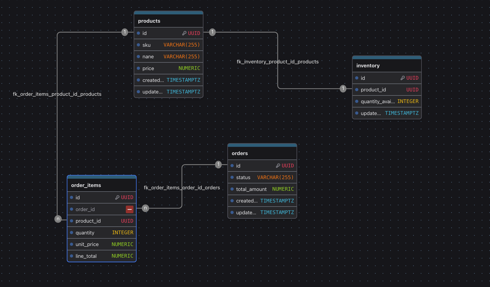

# Database Design

> Overview: This file explains the decisions behind our relational schema design

## Overview

The Order Processing API uses PostgreSQL as its primary database because order creation and inventory updates require strong relational integrity and ACID transaction guarantees.

The initial schema contains four core entities:

1. `products`
2. `inventory`
3. `orders`
4. `order_items`

The schema is designed to preserve data consistency, prevent invalid inventory states, and retain accurate historical order information. 

## Products

The `products` table stores catalogue information for items that can be ordered

Key design decisions:

- UUIDs are used as primary keys
- sku is unique and acts as the product's business identifier
- prices use `NUMERIC(12,2)` instead of floating-point types to preserve exact monetary values
- a database CHECK constraint prevents negative prices

## Inventory

Inventory is stored separately from product catalogue data.

Each product has one inventory record containing its current available quantity.

This separation keeps frequently changing operational state independent from relatively stable product information and allows inventory logic to evolve later e.g., by adding reserved quantities, warehouses, or reorder thresholds.

A database constraints ensures that `quantity_available` can never fall below zero.

## Orders

The `orders` table represents a customer's order.

Each order stores:

- a unique identifier
- current order status
- total monetary amount
- creation and update timestamps

`total_amount` uses an exact numeric type so order totals are not affected by unique floating-point precision errors. 

## Order items

The `order_items` table links products to orders.

Each row records:

- the associated order
- the purchased product
- quantity
- unit price at the time of purchase
- line total

The unit price is stored directly on the order item so historical orders remain accurate even if the product's catalogue price changes later.

**Relationships**

```text
Product 1 ───── 1 Inventory

Order   1 ───── * OrderItem

Product 1 ───── * OrderItem
```

## Data Integrity

Critical business rules are enforced at both the application and database layers.

Pydantic will validate incoming API requests, while PostgreSQL constraints protect the database from invalid data introduced through other paths such as background workers, admin scripts, migrations or direct SQL access.


